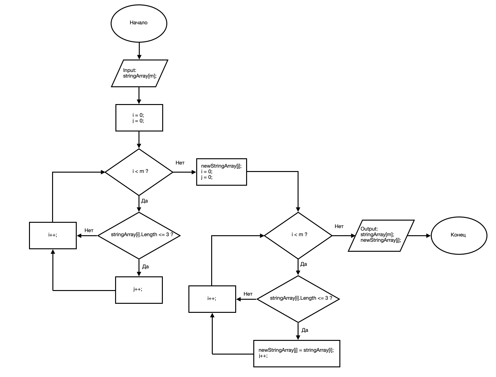

# В данном репо Вы найдете блок-схему и программу, написанную на С#, для следующей задачи:
```
Из имеющегося массива строк сформировать массив из строк, длина которых меньше либо равна 3.
```

Блок-схема для данной задачи будет следующей:


